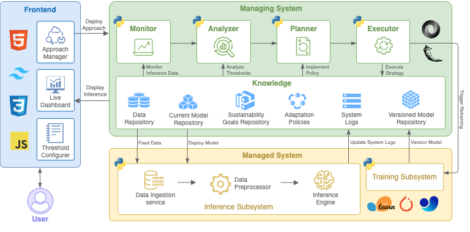

# Architecture and Design

This document details the architecture of Harmonica, mapping the conceptual components described in the associated research paper to the source code implementation provided in this artifact.

As illustrated in the diagram above, Harmonica consists of three primary components: the **Frontend**, the **Managing System**, and the **Managed System**. The following sections describe the implementation details of each.

## 1. Frontend

The Frontend serves as the user interaction layer, allowing researchers to configure sustainability goals and visualize the adaptation process in real-time. It is implemented as a single-page web application located in `tool/frontend/dashboard.html`.

The interface uses HTML, CSS (via the Tailwind CDN), and JavaScript to render the UI and communicate with the backend. It interacts with the Managing System via RESTful endpoints exposed by the Flask server.

### 1.1 Approach Manager
The Approach Manager enables the selection of specific adaptation strategies.
*   **Implementation:** This is implemented in the `welcome-screen` modal within `dashboard.html`.
*   **Functionality:** When a user selects an approach (e.g., "HarmonE" or "Simple Switch"), the frontend sends a POST request to the `/api/write-approach` endpoint defined in `tool/app.py`.
*   **Configuration:** The selection is persisted in `tool/approach.conf`. This configuration file tells the system which adaptation logic to load (e.g., `reg_harmone` vs. `cv_switch`).

### 1.2 Threshold Configurer
This component allows users to define adaptation boundaries (sustainability goals) at design time.
*   **Implementation:** Located in the "Policy Management" tab of `dashboard.html`.
*   **Functionality:** Users input thresholds for metrics such as energy consumption or accuracy. The JavaScript constructs a JSON policy object and posts it to `/api/policy`.
*   **Storage:** These configurations are saved as JSON files in the `tool/policies/` directory.

### 1.3 Live Dashboard
The Live Dashboard provides runtime observability of the system.
*   **Implementation:** Uses the `Chart.js` library within `dashboard.html` to render time-series graphs.
*   **Data Flow:** It polls the `/api/knowledge/<policy_id>` endpoint in `tool/app.py`. The backend aggregates telemetry from the Managed System and serves it to the frontend, allowing users to verify if the system is adhering to the configured thresholds.

## 2. Managing System

The Managing System is the core component responsible for the self-adaptation process. It is implemented primarily as a Python Flask server (`tool/app.py`) that orchestrates the MAPE-K loop and maintains the system's state.

### 2.1 Knowledge
The Knowledge component is a logical collection of repositories distributed across the file system and in-memory structures.

1.  **Data Repository:** Stores input data for the inference engine.
    *   *Code Location:* `tool/managed_system_<type>/data/` (e.g., BDD100K images).
2.  **System Logs:** Maintains historical records of system performance and adaptation events.
    *   *Code Location:* `tool/managed_system_<type>/knowledge/predictions.csv` (raw inference logs), `mape_log.csv` (adaptation decisions), and `event_log.csv`.
3.  **Sustainability Goals Repository:** Stores the active adaptation boundaries.
    *   *Code Location:* `tool/policies/*.json` (global policies) and `tool/managed_system_<type>/knowledge/thresholds.json` (local constraints).
4.  **Current Model Repository:** Contains the model artifact currently in use.
    *   *Code Location:* `tool/managed_system_<type>/models/` (e.g., `yolo_s.pt`, `lstm.pth`). The active model is identified by the content of `tool/managed_system_<type>/knowledge/model.csv`.
5.  **Adaptation Policies:** Defines the logic for detecting violations and selecting tactics.
    *   *Code Location:* `tool/policies/` contains the JSON definitions that map metrics to tactics (e.g., `cv_harmone_score.json`).
6.  **Versioned Model Repository:** Stores historical model versions created by the Training Subsystem.
    *   *Code Location:* `tool/managed_system_<type>/versionedMR/`. Subdirectories here (e.g., `version_1`, `version_2`) contain model weights and the training data distribution used to create them.

### 2.2 MAPE Loop
The Monitor-Analyze-Plan-Execute (MAPE) loop is implemented via a set of modular Python scripts located in `tool/managed_system_<type>/mape_logic/`.

*   **Monitor:** Implemented in `monitor.py`. It reads the `predictions.csv` log file, aggregates raw metrics (e.g., inference latency, confidence), and calculates derived metrics like the HarmonE score or KL divergence.
*   **Analyzer:** Implemented in `analyse.py`. It compares the monitored metrics against the thresholds defined in the Sustainability Goals Repository. It returns a boolean status indicating if a boundary violation or data drift has occurred.
*   **Planner:** Implemented in `plan.py`. When the Analyzer detects a violation, the Planner selects a remediation tactic. This may involve selecting a pre-trained model from the Current Model Repository or triggering a retrain.
*   **Executor:** Implemented in `execute.py`. It performs the physical adaptation.
    *   *Model Switch:* Updates `knowledge/model.csv` with the name of the new model.
    *   *Retraining:* Invokes the Training Subsystem (see Section 3.2).

## 3. Managed System

The Managed System represents the machine learning application subject to adaptation. It is wrapped by `tool/run_managed_system.py`, which manages the lifecycle of the following subsystems.

### 3.1 Inference Subsystem
This subsystem performs the primary function of the application (e.g., object detection or traffic flow prediction).
*   **Implementation:** `tool/managed_system_<type>/inference.py`.
*   **Data Ingestion Service:** Reads input data (images or CSV rows) from the Data Repository.
*   **Data Preprocessor:** Normalizes inputs (e.g., resizing images, scaling float values) before passing them to the model.
*   **Inference Engine:** Loads the active model defined in `knowledge/model.csv` and generates predictions. It records the result, confidence score, and energy consumption (measured via `pyRAPL`) into the System Logs.

### 3.2 Training Subsystem
This subsystem handles the evolution of models in response to data drift.
*   **Implementation:** `tool/managed_system_<type>/retrain.py`.
*   **Trigger:** It is invoked by the Executor component of the Managing System when the Planner determines that no existing model version is suitable for the current data distribution.
*   **Operation:** It fine-tunes the current model using the most recent data from the Data Repository.
*   **Output:** The new model weights and a snapshot of the training data statistics are saved to the Versioned Model Repository (`versionedMR/`) for future reuse.